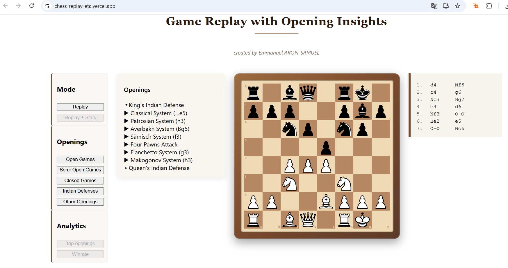

# Chess Replay – Event-Driven Chess Visualization

This project is a **web-based chess replay application** designed as a **real-world example of an event-driven architecture**.

A chess game is modeled as a **stream of domain events** (`MOVE_PLAYED`), enabling multiple independent processing pipelines such as real-time replay, analytics, and future data processing.

🌐 **Live demo**  
Frontend: https://chess-replay-eta.vercel.app  
Backend: https://chess-replay-v1.fly.dev

---

## Core Architecture

### Event-Driven Design
- Chess moves are published as events to **Kafka**
- Events are immutable and represent the **single source of truth**
- Multiple consumers can process the same events independently (**fan-out**)

Responsibilities are clearly separated:
- Replay (UI / real-time)
- Analytics (statistics, insights)
- Persistence (future)

---

## Kafka Consumers (Fan-out Pattern)

All consumers subscribe to the **same Kafka topic** (`chess.events`) but belong to **different consumer groups**.

This guarantees that:
- each consumer receives **all events**
- consumers are fully **decoupled**
- new pipelines can be added without modifying existing code

### 1) ReplayKafkaConsumer (UI / Real-time)

**Purpose:**  
Drive the chess replay in real time.

**Role:**
- Consumes `MOVE_PLAYED` events
- Streams moves to the frontend via **WebSocket**
- Acts as the bridge between Kafka and the UI

**Why it matters:**
- The frontend is completely unaware of Kafka
- Replay latency is isolated from other workloads
- Replay logic lives entirely in the backend

---

### 2) AnalyticsKafkaConsumer (Statistics / Data) *(in progress)*

**Purpose:**  
Compute analytics from historical chess data.

**Role:**
- Consumes the same `MOVE_PLAYED` events
- Aggregates data such as:
  - opening frequencies
  - move distributions
  - game lengths
- Designed to evolve toward batch / streaming pipelines (e.g. Spark)

**Why it exists:**
- Analytics must not impact replay latency
- Demonstrates Kafka fan-out and data-oriented design

---

### 3) PersistenceKafkaConsumer *(future)*

**Purpose:**  
Persist events for long-term storage and replay.

**Role:**
- Store raw events in a database or event store
- Enable full game reconstruction
- Serve as a base for ML datasets or audit logs

---

## Frontend

- Built with **React**
- Connects only via **WebSocket**
- Applies moves using `chess.js`
- Completely **decoupled from Kafka and backend internals**

---

## Tech Stack

- **Backend:** Java 21, Spring Boot, Kafka, WebSocket
- **Frontend:** React, chess.js
- **Infrastructure:** Docker, Fly.io (backend), Vercel (frontend)

---

## Project Structure & Branches

This repository explores multiple architectural approaches:

- `chess-replay-websocket-nokafka`  
  → Stable WebSocket-only baseline (no Kafka)

- `chess-replay-kafka-event-driven`  
  → Event-driven architecture with Kafka + WebSocket

Future branches may explore analytics, Spark, or persistence pipelines.

---

## Running locally (WebSocket only)

### Backend
```bash
mvn spring-boot:run
```

### Frontend
```bash
cd chess-frontend
npm install
npm start
```

Then open:  
http://localhost:3000

---

## Why this project

This project was built to:
- explore **event-driven backend design**
- apply **Kafka fan-out patterns** in a concrete use case
- connect **real-time systems and data processing**
- go beyond CRUD-style applications

---

## Next steps

- Finalize `AnalyticsKafkaConsumer`
- Add basic analytics endpoints
- Introduce persistence / event storage
- Explore batch or streaming pipelines (Spark)

---

## Author

Developed as a personal project to showcase backend architecture, event-driven systems, and data-oriented design.

## Example – King's Indian Defense



This screenshot shows a live replay of a King's Indian Defense variation,
with moves streamed via WebSocket and applied in real time on the frontend.


