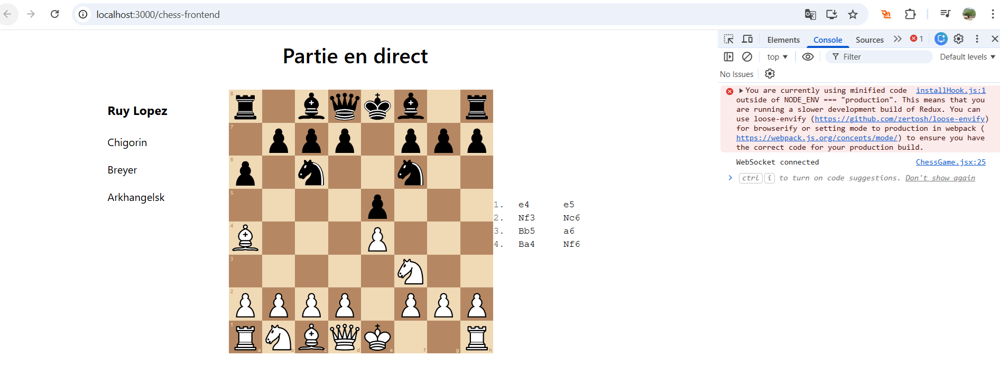
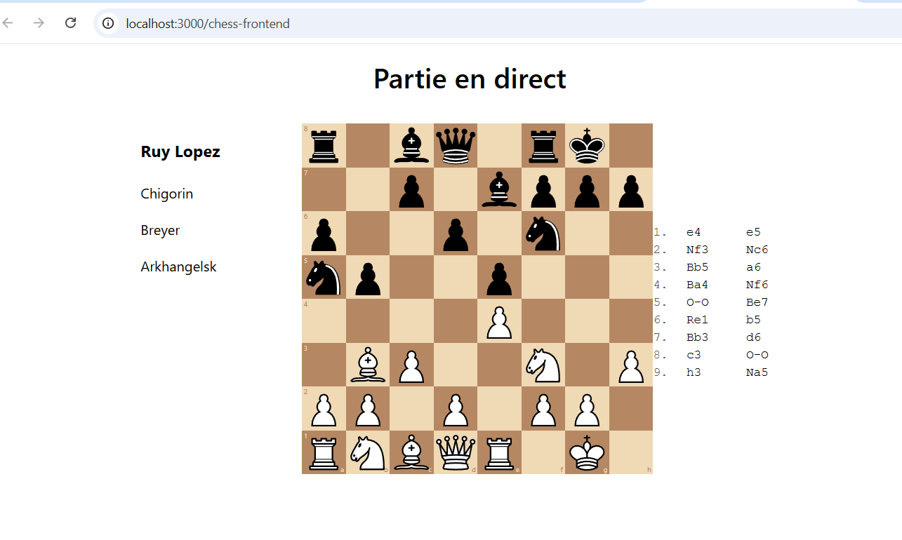

# Chess Replay – the git branch : WebSocket (No Kafka)

This branch demonstrates a **real-time chess replay system using WebSocket only**,  
without Kafka, as a **stabilized baseline** of the project.

It was created after an initial WebSocket + Kafka implementation, in order to:
- validate the WebSocket flow independently
- simplify debugging during Docker / Fly.io deployment
- introduce clean Spring profiles before re-enabling Kafka

---

## 🎯 Purpose of this branch

The goal of `chess-replay-websocket-nokafka` is to provide:

- a **fully working WebSocket replay**
- a **Kafka-free default execution**
- a **clear separation of concerns** using Spring profiles
- a reliable base for future evolutions (Kafka, streaming, deployment)

Kafka is intentionally **disabled by default** in this branch.

---

## 🏗️ Architecture (current state)

### Backend (Spring Boot)

- WebSocket endpoint exposed at:  
  ws://localhost:8080/chess

- Messages are **simple chess moves** (e.g. `e2e4`)
- Broadcast handled by a custom `ChessWebSocketHandler`
- REST endpoints used to trigger replays

### Frontend (React)

- Connects to the WebSocket server
- Receives moves in real time
- Applies them using `chess.js`
- Updates the board dynamically

---

## 🔁 Replay mechanism

A REST endpoint allows triggering a **progressive replay**:

GET /replay

Example sequence:

e2e4
(2s delay)
e7e5
(2s delay)
g1f3
...


Each move is broadcast via WebSocket and applied on the frontend.

This simulates a real-time game replay without Kafka.

---

## ⚙️ Spring Profiles

| Profile   | Description |
|----------|-------------|
| `default` | WebSocket only (Kafka disabled) |
| `local`   | WebSocket + Kafka (future / other branch) |
| `prod`    | WebSocket, Kafka disabled or external |

This branch focuses on the **`default` profile**.

---

## 🚀 How to run (no Kafka)

### Backend

```bash
mvn spring-boot:run
```

or on Windows:

```bat
start_without_kafka.bat
```

Frontend
```bash
cd chess-frontend
npm install
npm start
```

Then open:
http://localhost:3000

Configuration

WebSocket URL is configured via environment variable:
```env
REACT_APP_WS_URL=ws://localhost:8080/replayEspagnole
```
An example file is provided:
.env.example

Why Kafka is not used here

<br>
Kafka was already implemented in another branch, but temporarily removed here to:

- isolate WebSocket behavior

- reduce infrastructure complexity

- avoid coupling WebSocket debugging with Kafka/Docker issues

- prepare clean reintroduction via profiles

- Kafka can be re-enabled cleanly later without touching WebSocket logic.


---

## Demo – Ruy Lopez (Chigorin Variation)

### Initial position (Chigorin setup)

[](img/chigorin1.png)

👉 Click the image to view it in full size.

---

### Replay in progress (WebSocket live moves)

[](img/chigorin2.png)

👉 This screenshot shows the board updating in real time as moves are broadcast
via WebSocket and applied on the React frontend.

## Deployment

### Backend
- Fly.io
- Java 21 / Spring Boot
- WebSocket + REST
- URL: https://chess-replay-v1.fly.dev

### Frontend
- Vercel
- React (CRA)
- URL: https://chess-frontend-alpha.vercel.app

### Environment variables
REACT_APP_API_BASE=https://chess-replay-v1.fly.dev  
REACT_APP_WS_URL=wss://chess-replay-v1.fly.dev/chess

